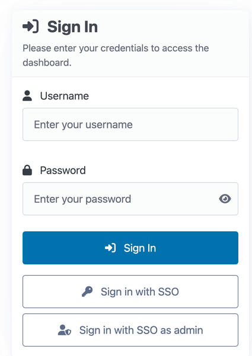
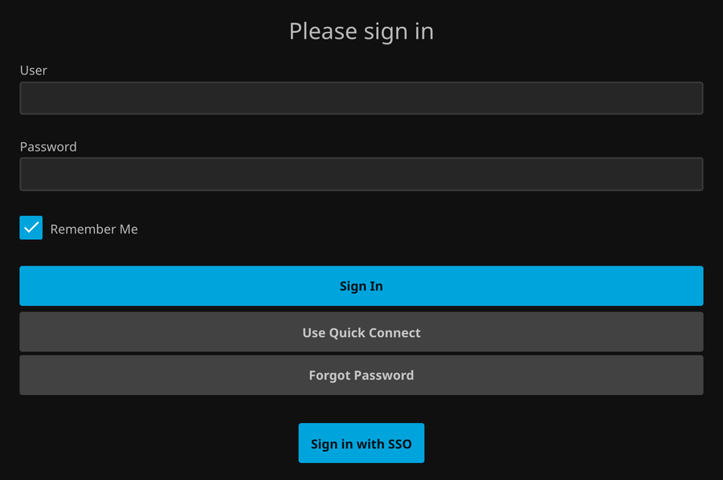
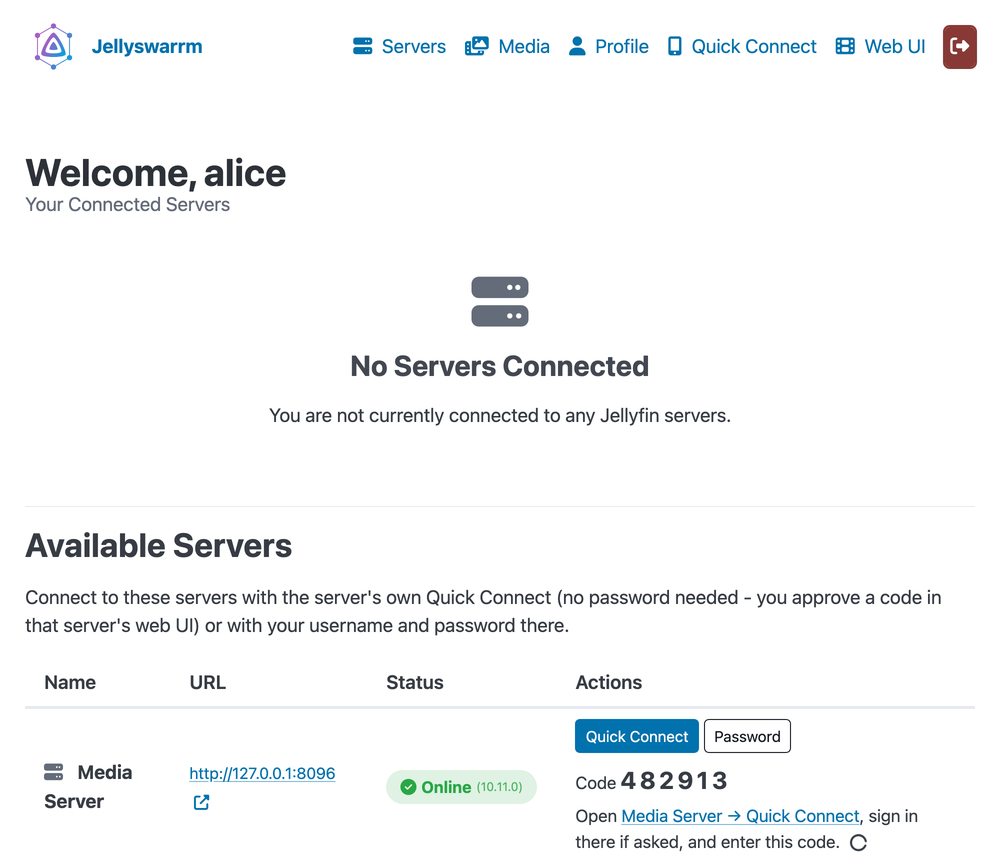

> [!NOTE]
> **This is a vibe-coded fork** of [LLukas22/Jellyswarrm](https://github.com/LLukas22/Jellyswarrm). With an AI coding assistant (Claude) it adds a few features on top of upstream: single sign-on through OpenID Connect for the dashboard and the web player, password-free accounts and server connections via the upstream servers' own Quick Connect, and a Quick Connect security fix. Images are published as `ghcr.io/eddyfussel/jellyswarrm`. Everything else is upstream's work - use at your own risk; the original project remains the reference.

<h1 align="center">Jellyswarrm</h1>

<h3 align="center">Many servers. Single experience.</h3>

<p align="center">

<br/>
<br/>
<a href="https://www.gnu.org/licenses/old-licenses/gpl-2.0.html">

</a>
<a href="https://github.com/LLukas22/Jellyswarrm/releases">

</a>
</p>

Jellyswarrm is a reverse proxy that lets you combine multiple Jellyfin servers into one place. If you’ve got libraries spread across different locations or just want everything together, Jellyswarrm makes it easy to access all your media from a single interface.

---

<p align="center">
  <!-- Full-width library view -->
  
</p>

<p align="center">
  <!-- Side-by-side smaller views, same height -->
  
  
  
</p>

## Features

> [!WARNING]
> Jellyswarrm is still in **early development**. It works, but some features are incomplete or missing. If you run into issues, please report them on the [GitHub Issues page](https://github.com/LLukas22/Jellyswarrm/issues).

### ✅ Working

* **Unified Library Access** – Browse media from multiple Jellyfin servers in one place.
* **Direct Playback** – Play content straight from the original server without extra overhead.
* **User Mapping** – Link accounts across servers for a consistent user experience.
* **API Compatibility** – Appears as a normal Jellyfin server, so existing apps and tools still work.
* **Server Federation** – Automatically sync users across connected servers.
* **User Page** – Personal dashboard for managing credentials and libraries. 
* **QuickConnect** – Sign in on one device by approving the code from another authenticated device.
* **Single Sign-On** – Sign in to the dashboard and the web player through an OpenID Connect provider; accounts and server connections work without passwords ([setup](#single-sign-on-openid-connect)).
* **Websocket Support** – Real-time connection for remote control and SyncPlay (SyncPlay itself is not extensively tested yet).
* **Audio Streaming** – Progressive and HLS audio, served through the same streaming path as video.
* **Bitrate Detection** – The web client's bandwidth test runs through Jellyswarrm, so it picks a fitting streaming quality.

### ⚠️ Not Supported Yet

* **Media Management** – Adding or deleting media libraries on the upstream servers through Jellyswarrm.

---

## Deployment

The easiest way to run Jellyswarrm is with the prebuilt [Docker images](https://github.com/LLukas22?tab=packages&repo_name=Jellyswarrm).
Here’s a minimal `docker-compose.yml` example to get started:

```yaml
services:
  jellyswarrm:
    image: ghcr.io/llukas22/jellyswarrm:latest
    container_name: jellyswarrm
    restart: unless-stopped
    ports:
      - 3000:3000
    volumes:
      - ./data:/app/data
    environment:
      - JELLYSWARRM_USERNAME=admin
      - JELLYSWARRM_PASSWORD=jellyswarrm # ⚠️ Change this in production!
```

Once the container is running, open:

* **Web UI (setup & management):** `http://[JELLYSWARRM_HOST]:[JELLYSWARRM_PORT]/ui`
  – Log in with the username and password you set in the environment variables.
  – From here, you can add your Jellyfin servers and configure user mappings.

* **Bundled Jellyfin Web Client:** `http://[JELLYSWARRM_HOST]:[JELLYSWARRM_PORT]`

For advanced configuration options, check out the [ui](./docs/ui.md) and [configuration](./docs/config.md) documentation.

---

## Single Sign-On (OpenID Connect)

Jellyswarrm can use an OpenID Connect provider (Pocket ID, Authelia, Authentik, Keycloak, ...) for its logins:

* the **dashboard** at `/ui` gets *Sign in with SSO*, plus *Sign in with SSO as admin* for members of an admin group;
* the **web player** gets *Sign in with SSO* on its login page;
* **native apps** sign in with Quick Connect, approved from the dashboard.

With a user group configured, nobody needs a password: accounts are created on the first sign-in, and upstream Jellyfin servers are connected through their own Quick Connect, so Jellyswarrm stores an access token instead of a password.

<p align="center">
  
  
</p>

### 1. Register Jellyswarrm at your provider

Create an OIDC client:

* **Type:** public client with PKCE. A confidential client with a secret works too.
* **Callback URL:** `https://<your-jellyswarrm-host>/ui/oidc/callback`, exactly as written.
* **Scopes:** `openid profile groups`. The `groups` claim decides who may sign in as admin and who gets an account.

### 2. Configure Jellyswarrm

```yaml
    environment:
      - JELLYSWARRM_OIDC__ISSUER_URL=https://auth.example.com
      - JELLYSWARRM_OIDC__CLIENT_ID=<client id>
      # - JELLYSWARRM_OIDC__CLIENT_SECRET=<secret>   # only for a confidential client
      - JELLYSWARRM_OIDC__REDIRECT_URL=https://jellyswarrm.example.com/ui/oidc/callback
      - JELLYSWARRM_OIDC__ADMIN_GROUP=jellyswarrm-admins   # may use "Sign in with SSO as admin"
      - JELLYSWARRM_OIDC__USER_GROUP=jellyfin-users        # get an account on first sign-in
```

The same settings can go into an `[oidc]` section of `jellyswarrm.toml`; see the [configuration docs](./docs/config.md#single-sign-on-openid-connect).

### 3. First sign-in and connecting servers

1. Open `/ui` and choose **Sign in with SSO**. On the first sign-in, a member of the user group gets an account named after their username at the provider.
2. Under **Servers**, choose **Quick Connect** next to a server. Jellyswarrm shows a code from that server.
3. Open the server's own web UI (the link next to the code), sign in there however that server allows, and approve the code on its Quick Connect page. The server then appears under *Your Connected Servers*.

The server must have Quick Connect enabled. Connecting with a username and password (*Password*) still works too.

<p align="center">
  
</p>

### 4. Watching

* **Web player:** choose **Sign in with SSO** on its login page. After the provider login, the player opens signed in.
* **Apps (TV, phone):** choose **Quick Connect** in the app and enter the code it shows on the dashboard's **Quick Connect** page.

An account that already exists with a password can link single sign-on under **Profile → Link single sign-on**.

---


## Local Development
### Getting Started
To get started with development, you'll need to clone the repository along with its submodules. This ensures you have all the necessary components for a complete build:

```bash
git clone --recurse-submodules https://github.com/LLukas22/Jellyswarrm.git
```

If you've already cloned the repository, you can initialize the submodules separately:

```bash
git submodule init
git submodule update
```


<details open>
<summary><strong>Docker</strong></summary>

The quickest way to get Jellyswarrm up and running is with Docker. Simply use the provided [docker-compose](./docker-compose.yml) configuration:

```bash
docker compose up -d
```

This will build and start the application with all necessary dependencies, perfect for both development and production deployments.
</details>

### Local Test Servers

To test Jellyswarrm against six preconfigured Jellyfin instances (two each for
Movies, TV Shows, and Music) and Seerr, run:

```bash
just setup
```

See the [development environment guide](dev/README.md) for URLs, credentials,
commands, Seerr compatibility status, and media licenses. Debug builds
automatically register all six local servers from `data/jellyswarrm.dev.toml`.


<details>
<summary><strong>Native Build</strong></summary>

For a native development setup, ensure you have both Rust and Node.js installed on your system. 

First, install the UI dependencies. You can use the convenient VS Code task `Install UI Dependencies` from the tasks.json file, or run it manually:

```bash
cd ui
npm install
cd ..
```

Once the dependencies are installed, build the entire project with:

```bash
cargo build --release
```

The build process is streamlined thanks to the included [`build.rs`](./crates/jellyswarrm-proxy/build.rs) script, which automatically compiles the web UI and embeds it into the final binary for a truly self-contained application.
</details>

## FAQ  

1. **Why not just add multiple servers directly in the Jellyfin app?**  
   Some Jellyfin apps do support multiple servers, but switching between them can be inconvenient. Jellyswarrm brings everything together in one place and also merges features like *Next Up* and *Recently Added* across all servers. This way, you can easily see what’s new in your own libraries or what your friends have added.  

2. **Will Jellyswarrm work with my existing Jellyfin apps?**  
   Most likely! Jellyswarrm presents itself as a standard Jellyfin server, so most clients should work out of the box. That said, not every Jellyfin client has been tested, so a few may have issues.  

3. **Why use Jellyswarrm instead of mounting a remote library via e.g. SMB?**  
   Jellyswarrm is built to **connect your servers with your friends’ servers** across different networks. Setting up SMB in these cases can be complicated, and performance is often worse. With Jellyswarrm, content is streamed directly from the original server, so all the heavy lifting (like transcoding) happens where the media actually lives.  
